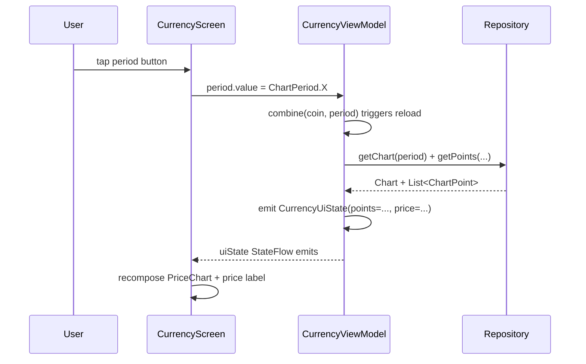

# Design Document: Compose Migration

## Overview

This migration replaces the entire view layer of BlockchainGraph with Jetpack Compose while leaving the Repository, ViewModel (data layer), and model classes untouched. The result is a single-activity app where `MainActivity` hosts a Compose `NavHost` instead of a `NavHostFragment`, and all screens are composable functions rather than `Fragment` subclasses.

The migration is a direct 1-to-1 replacement of each view-layer concept:

| Before | After |
|---|---|
| `AppCompatActivity` + `setContentView` | `ComponentActivity` + `setContent` |
| `NavHostFragment` + `nav_graph.xml` | `NavHost` composable |
| `BaseFragment` + `CurrencyFragment` | `CurrencyScreen` composable |
| `CoinPickerDialog` (DialogFragment) | `CoinPickerBottomSheet` (ModalBottomSheet) |
| XML `RadioGroup` | `PeriodSelector` composable |
| MPAndroidChart `LineChart` (AndroidView) | Vico `CartesianChartHost` (native Compose) |
| `MutableLiveData` in ViewModel | `StateFlow` + `collectAsState()` |
| `GlobalScope.launch` | `viewModelScope.launch` + `LaunchedEffect` |
| View Binding | Compose state |
| No edge-to-edge | `enableEdgeToEdge()` + `WindowInsets.safeDrawing` |
| Orientation locked / unhandled | Free rotation, ViewModel survives config change |

The Repository layer, Room database, Retrofit service, Koin module, and all model/entity/enumeration classes are **not modified**.

The migration also introduces edge-to-edge display and full rotation support — the app draws behind system bars and adapts its layout to both portrait and landscape orientations.

---

## Architecture

### Layer Diagram

```mermaid
graph TD
    subgraph "View Layer (NEW — Compose)"
        MA[MainActivity\nComponentActivity\nsetContent]
        NH[NavHost\nCompose Navigation]
        CS[CurrencyScreen\n@Composable]
        CP[CoinPickerBottomSheet\n@Composable ModalBottomSheet]
        PS[PeriodSelector\n@Composable]
        PC[PriceChart\n@Composable]
        TH[BlockchainGraphTheme\n@Composable MaterialTheme]
    end

    subgraph "ViewModel Layer (MODIFIED — StateFlow)"
        VM[CurrencyViewModel\nStateFlow coin/period/uiState\nviewModelScope]
        BVM[BaseViewModel\nerror: StateFlow]
    end

    subgraph "Repository Layer (UNCHANGED)"
        CR[CurrencyRepository]
        CHR[ChartRepository]
    end

    subgraph "Data Layer (UNCHANGED)"
        SVC[Retrofit Service]
        DB[Room BancoLocal]
    end

    MA --> TH
    TH --> NH
    NH --> CS
    CS --> CP
    CS --> PS
    CS --> PC
    CS -->|koinViewModel| VM
    VM --> BVM
    VM --> CR
    VM --> CHR
    CR --> SVC
    CR --> DB
    CHR --> SVC
    CHR --> DB
```

### Data Flow



---

## Components and Interfaces

### Package Structure

All new Compose UI files live under a new `ui` package tree. Existing packages are untouched.

```
com.osias.blockchain
├── ui/
│   ├── theme/
│   │   └── BlockchainGraphTheme.kt          # MaterialTheme wrapper
│   ├── screen/
│   │   └── CurrencyScreen.kt                # main screen composable
│   ├── component/
│   │   ├── CoinPickerBottomSheet.kt          # ModalBottomSheet currency picker
│   │   ├── PeriodSelector.kt                 # horizontal period toggle row
│   │   └── PriceChart.kt                     # Vico CartesianChartHost wrapper
│   └── navigation/
│       └── AppNavGraph.kt                    # NavHost + route definitions
├── view/
│   └── activity/
│       └── MainActivity.kt                   # MODIFIED: ComponentActivity + setContent
├── viewmodel/
│   ├── BaseViewModel.kt                      # MODIFIED: error as StateFlow
│   └── CurrencyViewModel.kt                  # MODIFIED: StateFlow + uiState + viewModelScope
└── ... (all other packages unchanged)
```

Test files:

```
app/src/test/java/com/osias/blockchain/
├── ui/
│   ├── CurrencyScreenTest.kt                 # Robolectric composable unit tests
│   ├── CoinPickerBottomSheetTest.kt
│   ├── PeriodSelectorTest.kt
│   └── PriceChartTest.kt
└── property/
    ├── ... (existing property tests unchanged)
    ├── CurrencyScreenPropertyTest.kt         # new PBT for composable state
    └── CurrencyViewModelPropertyTest.kt      # new PBT for ViewModel state

app/src/test/snapshots/                       # Roborazzi reference images (committed)
```

### Composable Signatures

```kotlin
// AppNavGraph.kt
@Composable
fun AppNavGraph(
    navController: NavHostController = rememberNavController()
)

// CurrencyScreen.kt
@Composable
fun CurrencyScreen(
    viewModel: CurrencyViewModel = koinViewModel()
)

// CoinPickerBottomSheet.kt
@Composable
fun CoinPickerBottomSheet(
    selectedCoin: CurrencyEnum,
    onCoinSelected: (CurrencyEnum) -> Unit,
    onDismiss: () -> Unit
)

// PeriodSelector.kt
@Composable
fun PeriodSelector(
    selectedPeriod: ChartPeriod,
    onPeriodSelected: (ChartPeriod) -> Unit,
    modifier: Modifier = Modifier
)

// PriceChart.kt
@Composable
fun PriceChart(
    points: List<ChartPoint>,
    formatXLabel: (Float) -> String,
    formatYLabel: (Double) -> String,
    modifier: Modifier = Modifier
)

// BlockchainGraphTheme.kt
@Composable
fun BlockchainGraphTheme(
    darkTheme: Boolean = isSystemInDarkTheme(),
    dynamicColor: Boolean = Build.VERSION.SDK_INT >= Build.VERSION_CODES.S,
    content: @Composable () -> Unit
)
```

---

## Data Models

### CurrencyUiState

The single source of truth for everything `CurrencyScreen` needs to render. The ViewModel emits a new instance whenever coin, period, price, or chart data changes.

```kotlin
// com.osias.blockchain.viewmodel.CurrencyUiState.kt
data class CurrencyUiState(
    val isLoading: Boolean = true,
    val formattedPrice: String = "",
    val chartPoints: List<ChartPoint> = emptyList(),
    val errorMessage: String? = null
)
```

States:
- **Loading**: `isLoading = true`, `formattedPrice = ""`, `chartPoints = emptyList()`
- **Loaded**: `isLoading = false`, `formattedPrice = "USD 42,000.00"`, `chartPoints = [...]`
- **Error**: `isLoading = false`, `errorMessage = "Network error"`, `chartPoints = emptyList()`

### CurrencyViewModel — StateFlow Migration

```kotlin
class CurrencyViewModel(
    private val currencyRepository: CurrencyRepository,
    private val chartsRepository: ChartRepository
) : BaseViewModel() {

    private val _coin = MutableStateFlow(CurrencyEnum.US_DOLLAR)
    val coin: StateFlow<CurrencyEnum> = _coin.asStateFlow()

    private val _period = MutableStateFlow(ChartPeriod.ONE_MONTH)
    val period: StateFlow<ChartPeriod> = _period.asStateFlow()

    private val _uiState = MutableStateFlow(CurrencyUiState())
    val uiState: StateFlow<CurrencyUiState> = _uiState.asStateFlow()

    init {
        // Whenever coin or period changes, reload data
        viewModelScope.launch {
            combine(_coin, _period) { coin, period -> coin to period }
                .collectLatest { (coin, period) -> loadData(coin, period) }
        }
    }

    fun selectCoin(coin: CurrencyEnum) { _coin.value = coin }
    fun selectPeriod(period: ChartPeriod) { _period.value = period }

    private suspend fun loadData(coin: CurrencyEnum, period: ChartPeriod) {
        _uiState.value = CurrencyUiState(isLoading = true)
        try {
            val currency = currencyRepository.getValueByCurrency(coin)
            val chart = chartsRepository.getCharts(period)
            val points = chartsRepository.getChartPoints(chart.time, chart.period)
            _uiState.value = CurrencyUiState(
                isLoading = false,
                formattedPrice = currency?.let { formatCurrency(it.lastValue) } ?: "",
                chartPoints = points
            )
        } catch (e: Exception) {
            _uiState.value = CurrencyUiState(
                isLoading = false,
                errorMessage = e.message ?: "Unknown error"
            )
        }
    }

    fun formatCurrency(value: Double): String { /* unchanged logic */ }
    fun formatUnixDate(value: Float): String { /* unchanged logic */ }

    override fun refreshItens() {
        viewModelScope.launch { loadData(_coin.value, _period.value) }
    }
}
```

Key changes from the current implementation:
- `MutableLiveData` → `MutableStateFlow` with private backing + public `asStateFlow()`
- `GlobalScope.launch` → `viewModelScope.launch`
- Reactive reload via `combine(_coin, _period).collectLatest { }` in `init` — no manual observer wiring in the Fragment
- `selectCoin` / `selectPeriod` replace direct `.value =` mutation from the Fragment

### BaseViewModel — StateFlow Migration

```kotlin
abstract class BaseViewModel : ViewModel() {
    private val _error = MutableStateFlow<String?>(null)
    val error: StateFlow<String?> = _error.asStateFlow()

    abstract fun refreshItens()
}
```

### Navigation Routes

```kotlin
// AppNavGraph.kt
object Routes {
    const val CURRENCY = "currency"
}

@Composable
fun AppNavGraph(navController: NavHostController = rememberNavController()) {
    NavHost(navController = navController, startDestination = Routes.CURRENCY) {
        composable(Routes.CURRENCY) {
            CurrencyScreen()
        }
    }
}
```

The current app has a single screen, so the nav graph has one destination. The `NavHost` replaces `NavHostFragment` + `nav_graph.xml` entirely.

---

## Edge-to-Edge and Rotation

### Edge-to-Edge

`enableEdgeToEdge()` is called in `MainActivity.onCreate()` before `setContent { }`. This makes the app draw behind the status bar and navigation bar on Android 15+ and on supported older versions via the AndroidX compat implementation.

`CurrencyScreen` applies `Modifier.windowInsetsPadding(WindowInsets.safeDrawing)` at the root of its layout so content is never obscured by system bars or display cutouts. The `PeriodSelector` at the bottom of the screen additionally consumes the navigation bar inset so its buttons are not hidden behind the gesture bar or button navigation bar.

```kotlin
// MainActivity.kt
override fun onCreate(savedInstanceState: Bundle?) {
    super.onCreate(savedInstanceState)
    enableEdgeToEdge()
    setContent {
        BlockchainGraphTheme {
            AppNavGraph()
        }
    }
}

// CurrencyScreen.kt — root scaffold
Scaffold(
    modifier = Modifier.windowInsetsPadding(WindowInsets.safeDrawing),
    bottomBar = {
        PeriodSelector(
            selectedPeriod = period,
            onPeriodSelected = viewModel::selectPeriod,
            // navigation bar inset already consumed by safeDrawing on the Scaffold
        )
    }
) { innerPadding ->
    // price card + PriceChart fill remaining space
}
```

### Rotation

Screen orientation is **not locked** in `AndroidManifest.xml`. Both portrait and landscape are supported.

State survival across rotation is handled automatically because `CurrencyViewModel` is a `ViewModel` — it survives configuration changes. The `StateFlow` values for `coin`, `period`, and `uiState` are retained without any extra `rememberSaveable` needed.

The `CoinPickerBottomSheet` visibility is controlled by a `var showPicker by remember { mutableStateOf(false) }` local state in `CurrencyScreen`. On rotation, `remember` is reset (not `rememberSaveable`), so the bottom sheet is dismissed — this is the correct behavior per Requirement 13.6.

`PriceChart` uses Vico's `CartesianChartHost` which is a standard composable that recomposes and remeasures when the window size changes. No special handling is needed for rotation resize.

---

## Correctness Properties

*A property is a characteristic or behavior that should hold true across all valid executions of a system — essentially, a formal statement about what the system should do. Properties serve as the bridge between human-readable specifications and machine-verifiable correctness guarantees.*

Property-based testing is applicable here because several requirements describe universal behaviors that hold across all values of `CurrencyEnum` (22 values), `ChartPeriod` (6 values), and `CurrencyUiState` inputs. The pure formatting functions and the callback-dispatch behavior of composables are well-suited to PBT.

The PBT library used is **[Kotest Property Testing](https://kotest.io/docs/proptest/property-based-testing.html)** (`io.kotest:kotest-property`), which provides `forAll`, `checkAll`, and built-in `Arb` generators for Kotlin.

### Property Reflection

Before finalizing properties, reviewing for redundancy:

- Req 3.3 (currency button shows symbol) and Req 3.2 (recompose on coin change) both involve coin state. They test different things: one tests the displayed text, the other tests that recomposition occurs. Not redundant — keep both.
- Req 4.3 (selected coin highlighted) and Req 4.4 (callback receives correct coin) both iterate over all CurrencyEnum values. They test different behaviors (visual state vs. callback value). Not redundant — keep both.
- Req 5.2 (selected period highlighted) and Req 5.3 (callback receives correct period) are analogous to 4.3/4.4 but for ChartPeriod. Not redundant — keep both.
- Req 4.2 (all 22 entries displayed) and Req 4.3 (selected entry highlighted) both iterate over CurrencyEnum. They can be combined: "for any CurrencyEnum, it appears in the list AND if it is the selected coin it is marked selected." Combine into one property.
- Req 5.1 (all 6 buttons displayed) and Req 5.2 (selected button highlighted) can similarly be combined.
- Req 6.3 (x-axis formatter) and Req 6.4 (y-axis formatter) are both pure function round-trip properties. They test different formatters — keep both but note they can share the same test structure.
- Req 7.3 (coin/period change triggers reload) and Req 7.5 (error emits errorMessage) are distinct ViewModel behaviors — keep both.

After reflection: 8 distinct properties remain.

---

### Property 1: Currency button displays the selected coin's symbol

*For any* `CurrencyEnum` value passed as the current coin state, the currency selection button in `CurrencyScreen` SHALL display that currency's `symbol` string.

**Validates: Requirements 3.3**

---

### Property 2: CoinPickerBottomSheet displays all entries and marks the selected one

*For any* `CurrencyEnum` value passed as `selectedCoin`, the `CoinPickerBottomSheet` SHALL display all 22 `CurrencyEnum` entries in its content, and the entry matching `selectedCoin` SHALL be visually marked as selected while all other entries are not.

**Validates: Requirements 4.2, 4.3**

---

### Property 3: CoinPickerBottomSheet callback receives the tapped coin

*For any* `CurrencyEnum` entry tapped in the `CoinPickerBottomSheet`, the `onCoinSelected` callback SHALL be invoked exactly once with that exact `CurrencyEnum` value.

**Validates: Requirements 4.4**

---

### Property 4: PeriodSelector displays all periods and marks the selected one

*For any* `ChartPeriod` value passed as `selectedPeriod`, the `PeriodSelector` SHALL display all six `ChartPeriod` buttons, and the button corresponding to `selectedPeriod` SHALL be visually distinguished while all other buttons are not.

**Validates: Requirements 5.1, 5.2**

---

### Property 5: PeriodSelector callback receives the tapped period

*For any* `ChartPeriod` button tapped in the `PeriodSelector`, the `onPeriodSelected` callback SHALL be invoked exactly once with that exact `ChartPeriod` value.

**Validates: Requirements 5.3**

---

### Property 6: PriceChart renders without crashing for any list of ChartPoints

*For any* list of `ChartPoint` values (including the empty list), the `PriceChart` composable SHALL render without throwing an exception or crashing.

**Validates: Requirements 6.2, 6.5**

---

### Property 7: ViewModel emits new uiState when coin or period changes

*For any* `CurrencyEnum` and `ChartPeriod` combination, when `selectCoin` or `selectPeriod` is called on `CurrencyViewModel`, the `uiState` StateFlow SHALL emit a new `CurrencyUiState` value (transitioning through loading and then to loaded or error).

**Validates: Requirements 7.3**

---

### Property 8: ViewModel emits errorMessage on failure

*For any* simulated repository failure (network error or database exception), the `CurrencyViewModel` SHALL emit a `CurrencyUiState` where `errorMessage` is non-null and `isLoading` is false.

**Validates: Requirements 7.5**

---

## Error Handling

### ViewModel Error Handling

Errors from repositories are caught in `loadData` and surfaced via `CurrencyUiState.errorMessage`. The ViewModel never re-throws. The existing `BaseRepository` error delegation pattern (`delegate?.onError(...)`) is preserved in the Repository layer; the ViewModel wraps the suspend calls in `try/catch` to translate repository errors into UI state.

```kotlin
private suspend fun loadData(coin: CurrencyEnum, period: ChartPeriod) {
    _uiState.value = CurrencyUiState(isLoading = true)
    try {
        // ... repository calls
    } catch (e: Exception) {
        _uiState.value = CurrencyUiState(isLoading = false, errorMessage = e.message ?: "Unknown error")
    }
}
```

### Composable Error Handling

`CurrencyScreen` reads `uiState.errorMessage` and displays an error message composable when it is non-null. No crashes propagate to the UI layer.

```kotlin
val uiState by viewModel.uiState.collectAsState()

when {
    uiState.isLoading -> CircularProgressIndicator()
    uiState.errorMessage != null -> uiState.errorMessage?.let { Text(it) }
    else -> { /* render price + chart */ }
}
```

### PriceChart Empty State

When `points` is empty, `PriceChart` renders a `CartesianChartHost` with an empty model producer — Vico handles this gracefully without crashing. No special null-check is needed.

### LaunchedEffect Cancellation

Side effects in `CurrencyScreen` use `LaunchedEffect(coin, period)`. When coin or period changes, Compose automatically cancels the previous `LaunchedEffect` coroutine before launching a new one, preventing stale data races.

---

## Testing Strategy

### Dual Testing Approach

Both unit/composable tests and property-based tests are used. Unit tests cover specific examples and structural requirements; property tests verify universal behaviors across all enum values and state combinations.

### Composable Unit Tests (Robolectric)

- Library: `androidx.compose.ui:ui-test-junit4` (BOM-managed) + `org.robolectric:robolectric`
- Runner: `@RunWith(RobolectricTestRunner::class)`
- Rule: `createComposeRule()`
- Location: `app/src/test/java/com/osias/blockchain/ui/`
- All tests use fake `StateFlow` values — no real repositories or network calls

#### Node Finding Strategy

All testable nodes are located using `Modifier.testTag("tag")` combined with `semantics { testTagsAsResourceId = true }` enabled at the root of each composable. Tests use `onNodeWithTag("tag")` exclusively — **never** `onNodeWithText` or `onNodeWithContentDescription` for structural assertions, as those are brittle to copy changes.

Test tags are defined as constants in a `TestTags` object co-located with each composable file:

```kotlin
// CurrencyScreen.kt
object CurrencyScreenTags {
    const val SELECT_COIN_BUTTON = "currency_screen_select_coin_button"
    const val LAST_QUOTE_LABEL   = "currency_screen_last_quote_label"
    const val PRICE_VALUE        = "currency_screen_price_value"
    const val LOADING_INDICATOR  = "currency_screen_loading_indicator"
}

// PeriodSelector.kt
object PeriodSelectorTags {
    const val ROOT               = "period_selector_root"
    fun periodButton(period: ChartPeriod) = "period_selector_button_${period.name}"
}

// CoinPickerBottomSheet.kt
object CoinPickerTags {
    const val ROOT               = "coin_picker_root"
    fun coinItem(coin: CurrencyEnum) = "coin_picker_item_${coin.name}"
}

// PriceChart.kt
object PriceChartTags {
    const val ROOT               = "price_chart_root"
}
```

`testTagsAsResourceId` is enabled at the `setContent` call site in each test so tags are also visible to UI Automator and Espresso if needed:

```kotlin
composeTestRule.setContent {
    BlockchainGraphTheme {
        CompositionLocalProvider(LocalInspectionMode provides true) {
            // composable under test
        }
    }
}
```

Example test using tag-based lookup:

```kotlin
@RunWith(RobolectricTestRunner::class)
class CurrencyScreenTest {
    @get:Rule val composeTestRule = createComposeRule()

    @Test fun `shows loading indicator when uiState is loading`() {
        composeTestRule.setContent {
            BlockchainGraphTheme {
                CurrencyScreen(uiState = CurrencyUiState(isLoading = true))
            }
        }
        composeTestRule
            .onNodeWithTag(CurrencyScreenTags.LOADING_INDICATOR)
            .assertIsDisplayed()
    }

    @Test fun `shows price value when uiState is loaded`() {
        composeTestRule.setContent {
            BlockchainGraphTheme {
                CurrencyScreen(uiState = CurrencyUiState(
                    isLoading = false,
                    formattedPrice = "USD 42,000.00"
                ))
            }
        }
        composeTestRule
            .onNodeWithTag(CurrencyScreenTags.PRICE_VALUE)
            .assertIsDisplayed()
    }
}
```

Test coverage per composable:

| Composable | Test tags | Test cases |
|---|---|---|
| `CurrencyScreen` | `SELECT_COIN_BUTTON`, `LAST_QUOTE_LABEL`, `PRICE_VALUE`, `LOADING_INDICATOR` | button displayed; label displayed; price shown when loaded; loading indicator when loading |
| `CoinPickerBottomSheet` | `ROOT`, `coinItem(coin)` per entry | all 22 entries displayed; selected entry marked; tap invokes callback with correct value |
| `PeriodSelector` | `ROOT`, `periodButton(period)` per period | all 6 buttons displayed; selected button distinguished; tap invokes callback with correct value |
| `PriceChart` | `ROOT` | renders without crash on empty list; renders without crash on non-empty list |

### Property-Based Tests

- Library: `io.kotest:kotest-property` (JVM, no Android framework needed for pure logic tests)
- Minimum 100 iterations per property
- Location: `app/src/test/java/com/osias/blockchain/property/`
- Tag format in comments: `Feature: compose-migration, Property N: <property text>`

```kotlin
// Feature: compose-migration, Property 3: CoinPickerBottomSheet callback receives the tapped coin
@Test fun `coin picker callback receives tapped coin`() = runTest {
    checkAll(Arb.enum<CurrencyEnum>()) { coin ->
        var received: CurrencyEnum? = null
        composeTestRule.setContent {
            BlockchainGraphTheme {
                CoinPickerBottomSheet(
                    selectedCoin = CurrencyEnum.US_DOLLAR,
                    onCoinSelected = { received = it },
                    onDismiss = {}
                )
            }
        }
        composeTestRule.onNodeWithText(coin.symbol).performClick()
        assertThat(received).isEqualTo(coin)
    }
}
```

### Screenshot Tests (Roborazzi)

- Library: `io.github.takahirom.roborazzi:roborazzi-compose:1.52.0`
- Plugin: `io.github.takahirom.roborazzi` applied in `app/build.gradle`
- Native Graphics: enabled via `robolectric.properties` with `nativeGraphicsMode=native`
- Reference images: `app/src/test/snapshots/` (committed to VCS)
- Tasks: `./gradlew recordRoborazziDebug` / `./gradlew verifyRoborazziDebug`

```kotlin
@Test fun `CurrencyScreen loaded state screenshot`() {
    composeTestRule.setContent {
        BlockchainGraphTheme { CurrencyScreen(viewModel = fakeViewModel) }
    }
    composeTestRule.onRoot().captureRoboImage("CurrencyScreen_loaded.png")
}
```

Two states captured per composable: loaded/default and loading/empty.

### Existing Tests

All existing tests in `repository/`, `viewmodel/`, and `property/` continue to pass unchanged. The ViewModel test (`CurrencyViewModelTest.kt`) will need updating to use `StateFlow` collection instead of `LiveData` observation, but the test logic remains the same.

---

## Gradle / Build Configuration Changes

### `app/build.gradle` diff summary

```groovy
// REMOVE
apply plugin: 'kotlin-android'
// ADD
apply plugin: 'org.jetbrains.kotlin.plugin.compose'
apply plugin: 'io.github.takahirom.roborazzi'

android {
    // REMOVE
    buildFeatures { viewBinding true }
    // ADD
    buildFeatures { compose true }
    // REMOVE composeOptions block entirely (no kotlinCompilerExtensionVersion needed)
}

dependencies {
    // REMOVE
    implementation "com.github.PhilJay:MPAndroidChart:v$charts_version"
    implementation "androidx.navigation:navigation-fragment-ktx:$nav_version"
    implementation "androidx.navigation:navigation-ui-ktx:$nav_version"
    implementation "androidx.appcompat:appcompat:$app_compat_version"
    implementation "androidx.constraintlayout:constraintlayout:$constraint_layout_version"
    implementation "androidx.lifecycle:lifecycle-livedata-ktx:$lifecycle_version"

    // ADD — Compose BOM (manages all androidx.compose.* versions)
    implementation platform("androidx.compose:compose-bom:2025.12.01")
    implementation "androidx.compose.ui:ui"
    implementation "androidx.compose.material3:material3"
    implementation "androidx.compose.ui:ui-tooling-preview"
    debugImplementation "androidx.compose.ui:ui-tooling"

    // ADD — Compose integrations (versioned outside BOM)
    implementation "androidx.activity:activity-compose:1.10.0"
    implementation "androidx.lifecycle:lifecycle-runtime-compose:2.9.0"
    implementation "androidx.navigation:navigation-compose:2.9.0"

    // ADD — Vico charts
    implementation "com.patrykandpatrick.vico:compose-m3:2.4.3"

    // ADD — Testing
    testImplementation "androidx.compose.ui:ui-test-junit4"
    testImplementation "org.robolectric:robolectric:4.13"
    testImplementation "io.kotest:kotest-property:5.9.1"
    testImplementation "io.github.takahirom.roborazzi:roborazzi-compose:1.52.0"
}
```

`robolectric.properties` (new file at `app/src/test/resources/robolectric.properties`):

```properties
nativeGraphicsMode=native
sdk=34
```

---

## Deletion Checklist

Files to delete as part of this migration:

### Kotlin source files
- `app/src/main/java/com/osias/blockchain/view/fragment/BaseFragment.kt`
- `app/src/main/java/com/osias/blockchain/view/fragment/CurrencyFragment.kt`
- `app/src/main/java/com/osias/blockchain/view/dialog/CoinPickerDialog.kt`

### XML layout files
- `app/src/main/res/layout/activity_main.xml`
- `app/src/main/res/layout/fragment_actual_currency.xml`
- `app/src/main/res/layout/dialog_coin_picker.xml`

### XML drawable files (replaced by Compose state-based styling)
- `app/src/main/res/drawable/radio_checked_state.xml`
- `app/src/main/res/drawable/radio_normal_state.xml`
- `app/src/main/res/drawable/radio_selector.xml`

### Navigation resource
- `app/src/main/res/navigation/nav_graph.xml`

### Verification
After deletion, `./gradlew assembleDebug` must succeed with zero references to:
- `R.layout.activity_main`, `R.layout.fragment_actual_currency`, `R.layout.dialog_coin_picker`
- `R.drawable.radio_checked_state`, `R.drawable.radio_normal_state`, `R.drawable.radio_selector`
- `FragmentActualCurrencyBinding`, `DialogCoinPickerBinding`
- `GlobalScope`
- `AppCompatActivity`, `NavHostFragment`, `DialogFragment`

Additionally verify:
- `AndroidManifest.xml` has no `android:screenOrientation` attribute on any `<activity>`
- `MainActivity` calls `enableEdgeToEdge()` before `setContent { }`
- `CurrencyScreen` root layout applies `WindowInsets.safeDrawing` padding

---

## Post-Migration Documentation Update

The final step of the migration is updating the three steering documents to reflect the new Compose-based codebase. These updates must happen **after** all composables are implemented, all tests pass, and all XML/Fragment files have been deleted.

### `.kiro/steering/project-context.md`

- Update the tech stack table: replace MPAndroidChart with Vico 2.4.3, add Compose BOM 2025.12.01, add navigation-compose 2.9.0, add Roborazzi 1.52.0
- Remove all references to XML layouts, View Binding, `NavHostFragment`, and `DialogFragment`
- Update the package structure section to reflect the new `ui/` package tree
- Update the "Running Tests" section to include `./gradlew recordRoborazziDebug` and `./gradlew verifyRoborazziDebug`

### `.kiro/steering/architecture.md`

- Replace the View Layer section: Fragment/Dialog/ViewBinding patterns → composable functions, `StateFlow`/`collectAsState`, `LaunchedEffect`, `viewModelScope`
- Update the layer diagram to show `CurrencyScreen`, `CoinPickerBottomSheet`, `PeriodSelector`, `PriceChart` instead of Fragment/Dialog
- Update the "Adding a New Screen" checklist to reflect the Compose workflow:
  1. Create `XyzViewModel` extending `BaseViewModel`
  2. Add `viewModel { XyzViewModel(get()) }` to `appModule`
  3. Create `XyzScreen` composable in `ui/screen/`
  4. Define `XyzScreenTags` object with test tag constants
  5. Add a `composable(Routes.XYZ)` entry in `AppNavGraph`
  6. Write Robolectric unit tests using `onNodeWithTag()`
  7. Write Roborazzi screenshot tests and record baselines

### `.kiro/steering/code-style.md`

- Remove the View Binding section entirely
- Add a Compose section covering:
  - `collectAsState()` for observing `StateFlow` in composables
  - `LaunchedEffect` for side effects keyed on state values
  - No `!!` anywhere — use `?.let { }` for nullable unwrapping
  - `Modifier.testTag()` on every testable node; `testTagsAsResourceId = true` at semantic root
  - `TestTags` constants object co-located with each composable file
  - `remember { mutableStateOf(false) }` (not `rememberSaveable`) for transient UI state like bottom sheet visibility
